+++
title = 'Peforming Activities on the Network with Azure'
date = 2024-12-24T06:50:03-08:00
draft = false
description = "Performing activites on the network with two VMs with Azure"
categories = ["Azure"]
tags = ["VMs", "ICMP", "Firewall", "SSH", "DHCP"]
+++

## Creating the VMs

In order to create the VMs, we need to put them ino the same `Resource Group`. I
named this group: `RG-Network-Activities`, but you can name it whatever you
like.

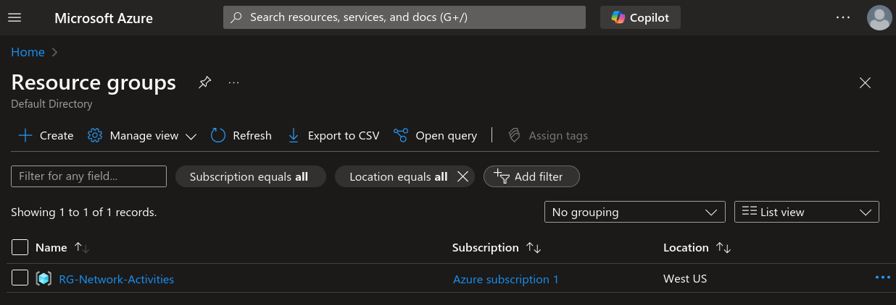

After that we'll create two VMs on the same network. One being Windows and the
other being Linux (Ubuntu). Make sure they're on the same region!

### Windows VM

Make sure the VM is under the resource group we created. I picked the standard
size with 2 vcpus and 16GiB of memory for this VM.

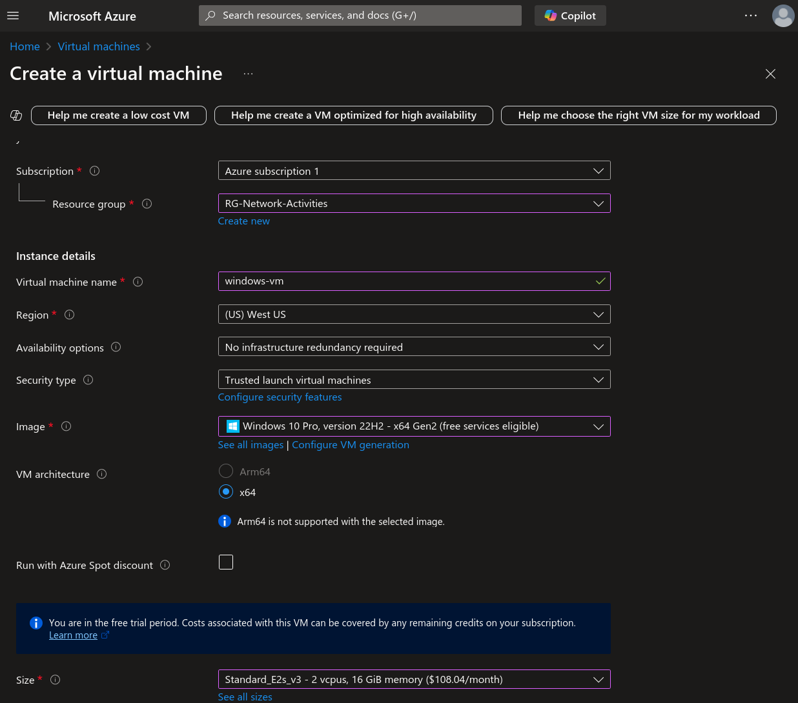

The last step is to create a virtual network. In this case I created a new one
and called it `lab-vnet` as shown below.

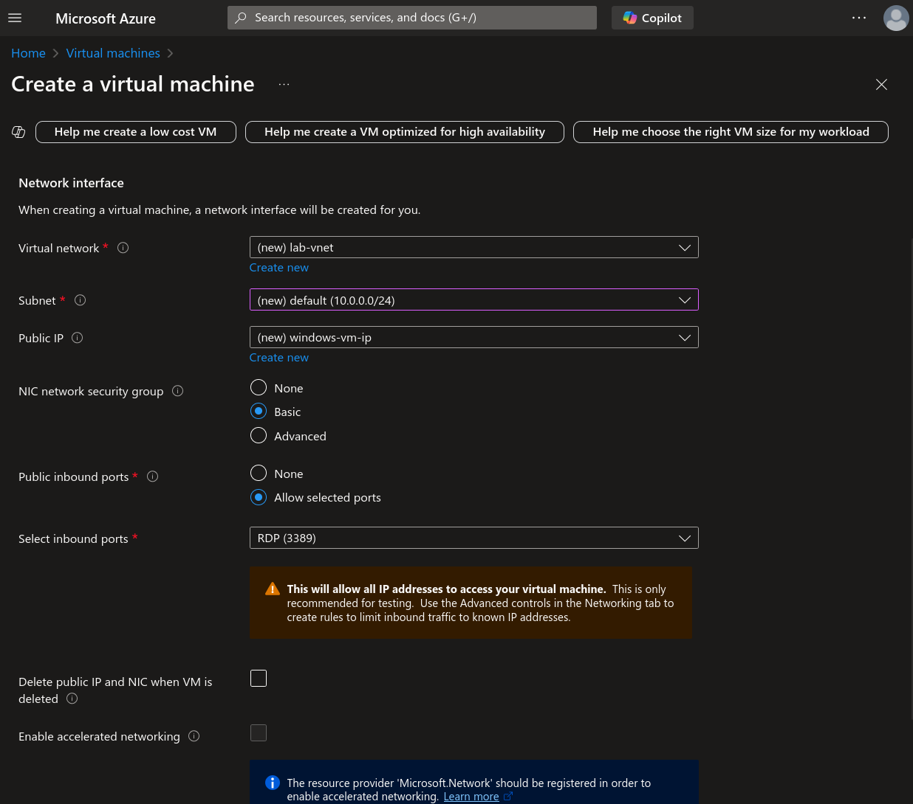

### Linux VM

We follow the same logic for the Linux VM, only this time pick the correct
image. In my case I went with the latest Ubuntu LTS version.

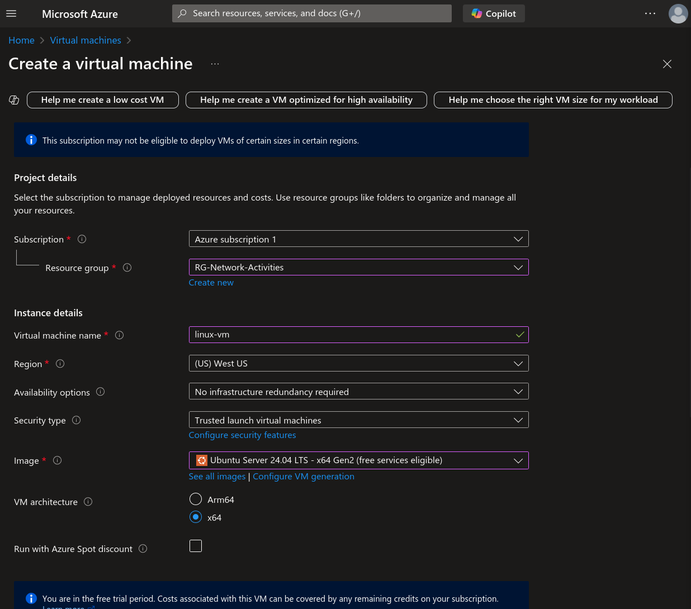

However, under the `Adminstrator Account` make sure to change the setting from
`SSH public key` to `Password`. Although it is a good security practice, this
is just a demo and it make our lives a little easier.

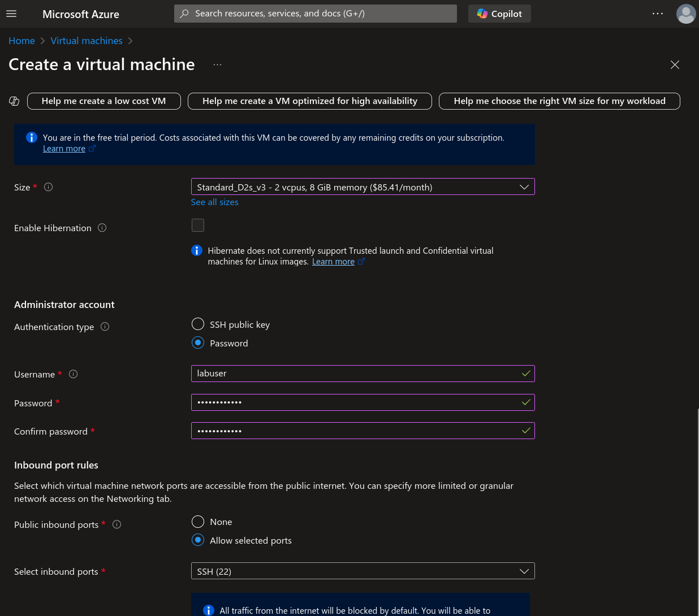

Then just make sure Linux VM is under the same virtual network as the Windows VM.

## Connect to Windows VM

In order to connect to the Windows VM, we must need a way to connect to the VM
using the RDP protocol. This allows us to interact with the VM as if we had
the computer screen in front of us.

- For Windows use: `Remote Desktop Client`
- For Mac use: `Microsoft Remote Desktop`

If you're on Linux however, we can use the [FreeRDP](https://github.com/FreeRDP/FreeRDP) package, a command line tool.

If you're on Ubuntu/Debian, we can install it using apt.

- If you're on X11 use:

  ```bash
  sudo apt install freedrp2-x11
  ```

- If you're on Wayland use:

  ```bash
  sudo apt install freedrp2-wayland
  ```

Once that's installed, we can connect to it like this

```bash
xfreedrp /u:<user_name> /p:<password> /v:<public_ip_of_windows_vm> /f
```

- The `/f` command is for fullscreen.

So in my case, my command would look something like this

```bash
xfreerdp /u:labuser /p:Cyberlab123! /v:40.78.64.143 /f
```

Just say `Y` to trust the certificate and you should be able to login and
interact with the VM.

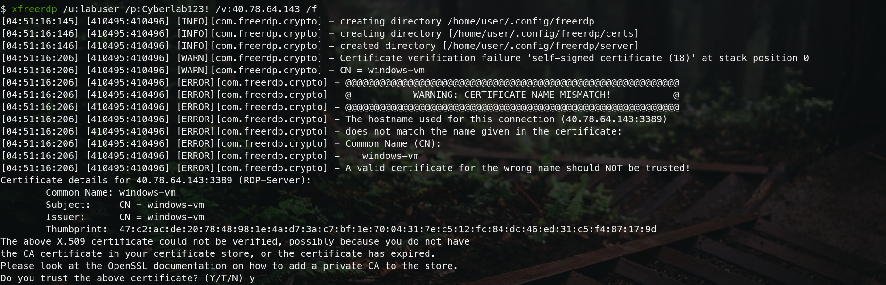

## Observe ICMP Traffic

In order to observer the traffic, we'll be using Wireshark. So install Wireshark
onto the Windows VM.

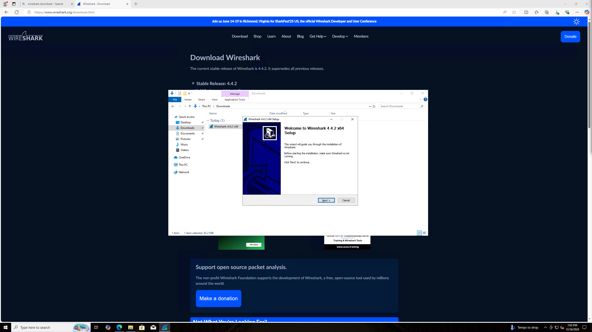

Now, that it's installed, we can observe the ICMP traffic if we ping the Linux
VM. The private ip for the Linux VM in my case is `10.0.0.5`. If we run the ping
command, you'll be shown with this.

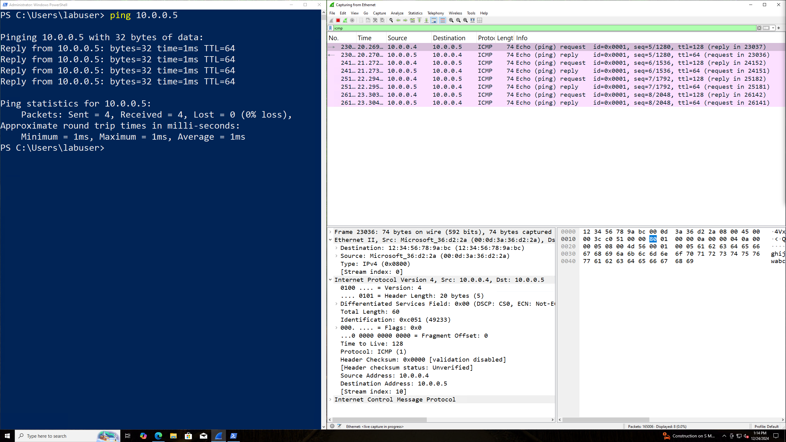

You'll notice, that 10.0.0.4 (Windows VM) sends a request to the 10.0.0.5 (Linux VM). Which then causes the Linux VM to reply back!

## Configure a Firewall

Now we can create a firewall to disable the ICMP traffic. If we go into Azure and change the settings for the Linux VM. We can create an inbound rule as shown below.


Now if we wait a while and try pinging again. We can see that our request times out and we don't get the reply back from the Linux VM.

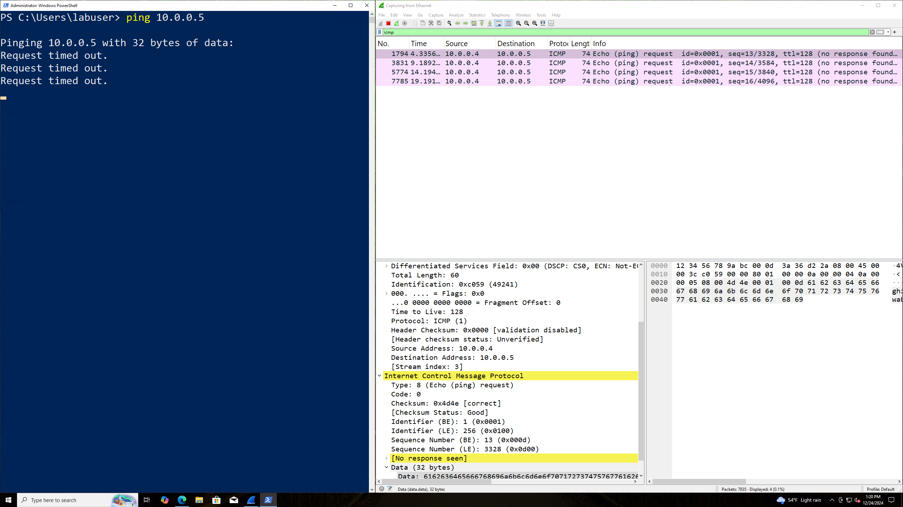

If you delete this rule and try pinging again. You'll get the reply back!

## Observe SSH Traffic

Let's get into observing the SSH traffic. From the Windows VM, we can ssh into
the Linux VM via its private IP address.

We can open up powershell and type the following

```powershell
ssh <username>@<private_ip_of_linux_vm>
```

Then just enter the password for this user. You'll notice the SSH traffic in wireshark whenever you start typing in the command line as shown below.

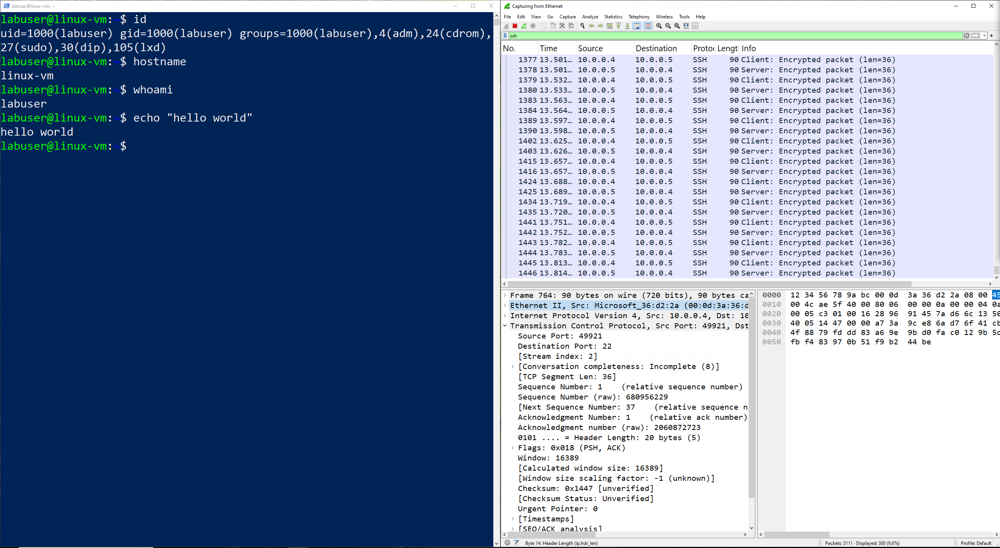

This is somewhat doing a similar protocol to the RDP (3389) but only this time, its from the command line and RDP is using a GUI.

## Observe DHCP Traffic

Now lets see some DHCP traffic. This protcol is used whenever a device or node
is not assigned a static IP. So it request from the DHCP server an IP to borrow.
In order to see this in action, we'll need to make a small batch file

```batch
ipconfig /release
ipconfig /renew
```

I created this file inside my `Downloads` directory and name it `dhcp.bat`. Then
I execute the file within the command line.

Now this make disconnect you from the RDP client tool you're using. This is ok, as we'll still be able to see the traffic when logging back into the Windows VM.

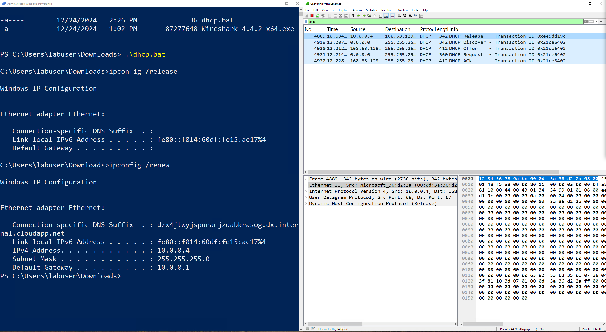

As you can see, we release the IP the VM was initially given and gets a new ip
from the DHCP server!
