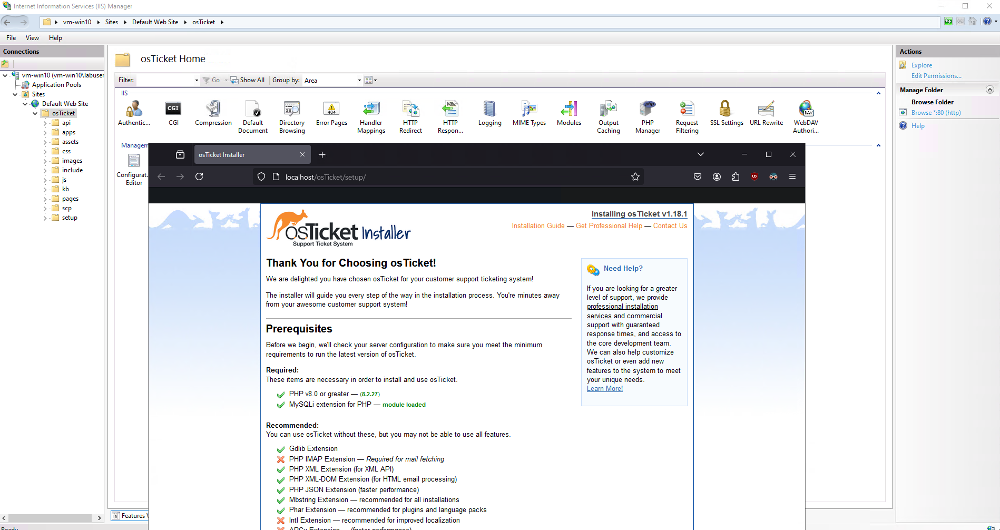
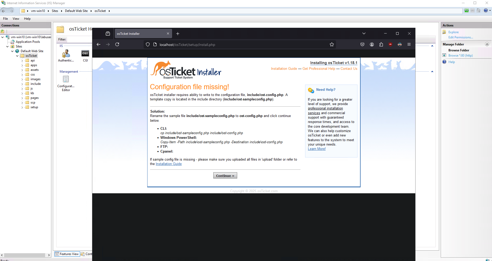

+++
title = 'osTicket - Prerequisites and Installation'
date = 2024-12-25T13:22:15-08:00
draft = false
+++

This tutorial walks you through the prerequisites and installation steps for
setting up the open-source help desk ticketing system, osTicket, on a Windows
virtual machine. It covers the installation of necessary components like IIS,
PHP, MySQL, and osTicket itself, as well as configuration and setup for a fully
functional help desk system. Follow these steps to get osTicket running on your
Windows server for streamlined support management.

## List of Prerequisites

- Download the following in the documentation: [PHP 8.2, MySQL, PHP Manager](https://docs.osticket.com/en/latest/Getting%20Started/Installation.html)
- Download [Rewrite Module (x64) to transform incoming URLs](https://www.iis.net/downloads/microsoft/url-rewrite)
- Download [VC Redist (x64) for MySQL](https://learn.microsoft.com/en-us/cpp/windows/latest-supported-vc-redist?view=msvc-170#latest-microsoft-visual-c-redistributable-version)
- Download [Heidi SQL to interact with DB](https://www.heidisql.com/download.php)
- Download [osTicket v1.18+](https://osticket.com/download/)
  - When downloading osTicket, you can leave the plugins options empty

## Installation Steps

### Create the Windows VM

Set up your virtual machine with Windows 10 Pro, version 22H2.

- Ensure the VM is allocated at least 4 vCPUs and 16 GB of RAM for optimal
  performance.

Then connect to the VM with an RDP client such as **Remote Desktop** on Windows.
However, if you're using Linux, use **FreeRDP** and follow this guide [here](./../../../posts/connect-to-windows-with-freerdp/)

### Enable IIS

Next, open the Control Panel and navigate to "Programs."


Then, click on "Turn Windows features on or off."


In the Windows Features dialog, enable IIS along with CGI and Common HTTP
Features under "World Wide Web Services" -> "Application Development Features."

- [x] CGI
- [x] Common HTTP Features

<div style="display: flex; justify-content: space-between; gap: 4px;">
  <figure style="width: 50%; text-align: center;">
    
    <figcaption>CGI</figcaption>
  </figure>
  <figure style="width: 50%; text-align: center;">
    
    <figcaption>Common HTTP Features</figcaption>
  </figure>
</div>

#### Verify IIS Installation

To verify that IIS is installed and enabled, open a web browser and navigate
to `localhost` or `127.0.0.1`. You should see a page similar to the one below.

")

### Installation Files

Now that IIS is enabled:

- Install _PHP Manager_
- Install _Rewrite Module_
- Install _VC Redist_
- Create a folder in the `C:` drive named "**PHP**"
- Unzip _PHP_ and insert the contents into `C:\PHP`
  - Move the files instead of copying them over by **Ctrl+X** then **Ctrl+V**
    into the destination folder.
- Install _HeidiSQL_
- Install _MySQL_
  - Select the **Server** install option
  - Set the root password as **root** for simplicity
  - 
  - Accept all defaults
- Unzip _osTicket_
  - Move the **upload** folder into `C:\inetpub\wwwroot`
  - Rename it to **osTicket**.

### Configuration

#### Register a new PHP version.

After installing the required files, search for IIS in the Windows search bar.
Open IIS as an administrator and register PHP within IIS.

<div style="display: flex; justify-content: space-between; gap: 4px;">
  <figure style="width: 50%; text-align: center;">
    
    <figcaption>IIS</figcaption>
  </figure>
  <figure style="width: 50%; text-align: center;">
    
    <figcaption>Register PHP</figcaption>
  </figure>
</div>


Provide the path to the `php-cgi.exe` file inside the PHP folder as shown below:


Then, restart the IIS server by stopping and starting it again. Now on the left
hand side navigate to sites and select the **osTicket** folder, then click on
**Browse \*80 (http)**. You'll be presented with this screen:



From here, we'll be able to click on the **continue** button at the bottom of
the page.

<!-- #### Add PHP Extensions

In IIS, navigate to **Sites** -> **Default** -> **osTicket**. On the right,
click "Browse \*:80".


Some extensions are disabled by default. To enable them:

1. Go back to IIS, **Sites** -> **Default** -> **osTicket**
2. Double-click **PHP Manager**
3. Click "Enable or disable an extension"
4. Enable the following extensions:
   - `php_imap.dll`
   - `php_intl.dll`
   - `php_opcache.dll`

 -->

#### Rename and Set File Permissions



As shown above, rename **ost-sampleconfig.php** file located
in `C:\inetpub\wwwroot\osTicket\include\` to **ost-config.php**. Use the
following within the command line as admin.

```powershell
Copy-Item -Path C:\inetpub\wwwroot\osTicket\include\ost-sampleconfig.php -Destination C:\inetpub\wwwroot\osTicket\include\ost-config.php
```

Then give the file full read and write access to Everyone. We'll change this to
read-only once we're done. Run the following in the command line as admin.

```powershell
icacls C:\inetpub\wwwroot\osTicket\include\ost-config.php /grant 'Everyone:F'
```

#### Create Database Table


Within HeidiSQL:

1. Right-click on the left sidebar where it says "Unnamed"
2. Select **Create new** and then choose **Database**
3. Name the new database `osTicket`

#### osTicket Installer

Now that the database is set up, go through the osTicket installer by navigating
to `localhost/osTicket/setup/`. In the MySQL Database section, enter `osTicket`.


#### Login

Once the installation is complete, log in with the email and password you set up
during the installation process.


### Clean up

Now when you first login, you see some warnings at the top of the page to clean
up after installation. All you need to do is delete the **setup** directory and
change **ost-config.php** file's permission. Open up the command line as admin
and run the following:

```powershell
# Remove the directory
rmdir /S C:\inetpub\wwwroot\osTicket\setup

# Change the file permission
icacls C:\inetpub\wwwroot\osTicket\include\ost-config.php /grant:r Everyone:(R)
```
